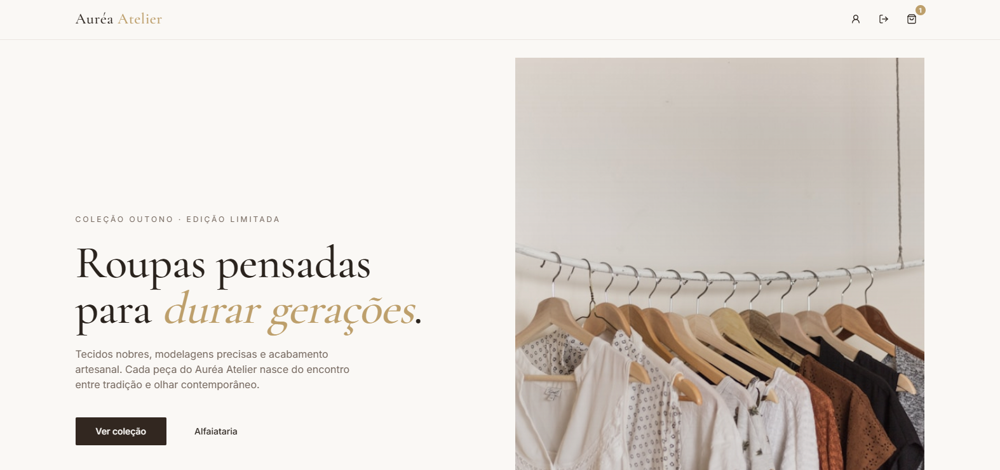
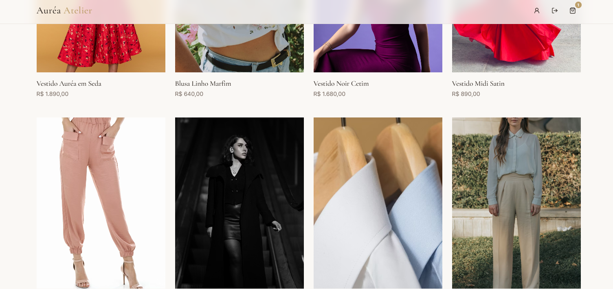
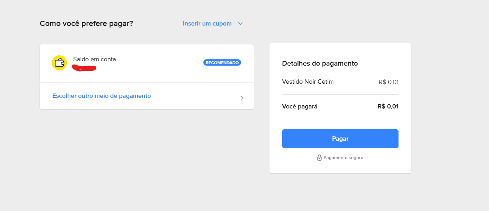

# Auréa Atelier

Plataforma de e-commerce com foco em fluxos de checkout, segurança de dados e automação de notificações. O projeto demonstra a integração entre um backend robusto em Python e um frontend dinâmico em React, cobrindo desde a autenticação até a finalização da compra.

## 📸 Demonstração

### Interface da Loja

*Página inicial da loja.*

### Produtos

*Alguns dos produtos da loja.*

### Checkout e Pagamento

*Integração com a API do Mercado Pago em ambiente de testes.*

## 🛠️ Stack Técnica

- **Backend:** FastAPI (Python), PostgreSQL, SQLAlchemy.
- **Frontend:** React, TypeScript, Tailwind CSS.
- **APIs de Terceiros:**
  - **Mercado Pago:** Processamento de pagamentos e gestão de preferências.
  - **Twilio:** Envio de códigos de verificação via WhatsApp.
  - **Resend:** Verificação de e-mail.

## 🚀 Funcionalidades

- **Checkout Pro (Sandbox):** Integração completa com o ambiente de testes do Mercado Pago. O sistema gera uma preferência de pagamento com valores simbólicos (R$ 0,01) para validar a comunicação entre servidores sem transações financeiras reais.
- **Autenticação em Duas Etapas:** Sistema de segurança que exige verificação simultânea via WhatsApp e e-mail antes de liberar o acesso à conta.
- **Arquitetura Full Stack:** Separação clara entre a lógica de negócio no backend e a interface do usuário no frontend.

## ⚙️ Configuração do Projeto

### 1. Backend (Python)

```bash
# Navegue até a pasta da API
cd backend

# Crie e ative o ambiente virtual
python -m venv venv
.\venv\Scripts\activate

# Instale as dependências
pip install -r requirements.txt

# Inicie o servidor
uvicorn main:app --reload
```

### 2. Frontend (Web)

```bash
# Navegue até a pasta web
cd frontend

# Instale as dependências
npm install

# Inicie a aplicação
npm run dev
```